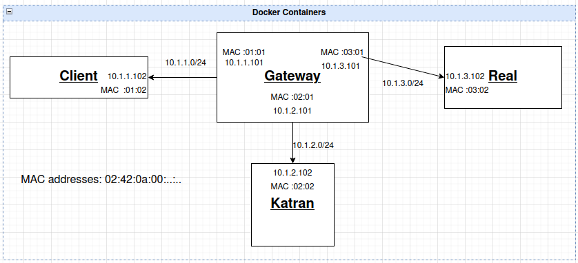

# eBPF Load Balancer
This project utilizes [katran](https://github.com/facebookincubator/katran) for use as a load balancer between MQTT clients and an MQTT cluster of brokers. It is currently under development. The used topology includes client, Katran LB, gateway and real-server. These services run into Docker containers that have a specific network connection as shown here.



## Docker setup
On your WSL2 / Linux host execute:
```bash
git clone https://github.com/nickpapakon/load-balancer-eBPF.git
cd load-balancer-eBPF/lb-n-reals/
```
Ensure Docker Desktop is up and running and then,
```bash
docker compose up --build -d
```
After docker compose command completes (it may take 20-30 minutes), 
Wait until the entrypoint scripts `setup.sh` finish (watch the logs of each container) and then ensure that all containers are up and running.

### Katran container Setup

Open 3 terminals `termA`, `termB`, `termC` executing the katran docker container shell by using 
```bash
docker exec -it katran sh
```
- On `termA` terminal, run the katran server
```bash
cd /home/simple_user/katran/_build
sudo ./build/example_grpc/katran_server_grpc -balancer_prog ./deps/bpfprog/bpf/balancer.bpf.o  -forwarding_cores=0 -hc_forwarding=false -lru_size=10000 -default_mac ${GATEWAY_KATRAN_MAC}
```
- On `termB`, run client commands to configure VIPs and reals for Katran
```bash
cd /home/simple_user/katran/example_grpc/goclient/src/katranc/main
./main -A -t ${VIP_1}:8000
./main -a -t ${VIP_1}:8000 -r ${REAL_IP}
./main -l
```
- On `termC`, use bpftool to inspect the logs of the bpf program
```bash
cat /sys/kernel/debug/tracing/trace_pipe
```
<!--
```bash
bpftool prog list
bpftool prog tracelog

sudo bpftrace -e 'tracepoint:xdp:* { @cnt[probe] = count(); }'

bpftrace -e \
 'tracepoint:xdp:xdp_bulk_tx{@redir_errno[-args->err] = count();}'
```
-->

### Client container
In a similar way, open a terminal and execute the shell of client container
```bash
docker exec -it client sh
```
Ensure the following curl to real ip succeeds and returns a welcoming message
```bash
curl -m 3 http://${REAL_IP}:8000
```
Then try to make the request to katran:
```bash
curl -m 3 http://${VIP_1}:8000
```
You should get the same response from the server and you should be able to see the katran logs on `termC`
```txt
bpf_trace_printk: Redirecting packet to real ...
```

### Debugging tools-steps
- Run tcpdump on interfaces of `gateway` and `real` containers
- change the docker containers networking that is configured on `compose.yaml` (`macvlan` worked)
